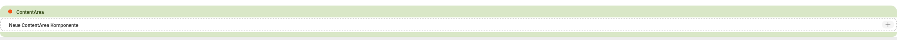
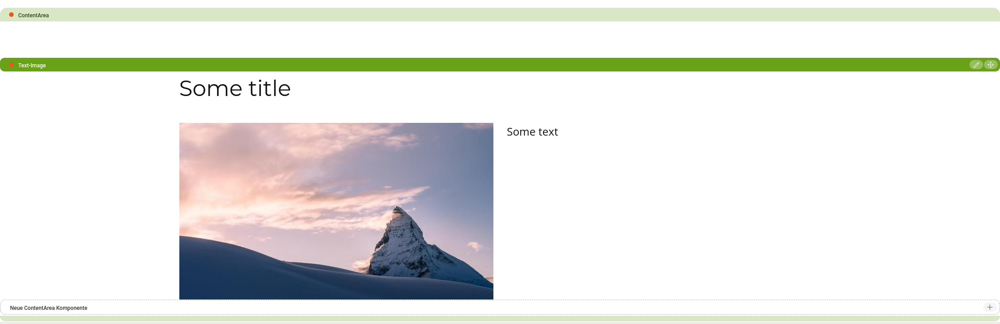

# Helpers
Helpers must extend [NamedHelper](light-development/src/main/java/com/merkle/oss/magnolia/renderer/handlebars/helpers/NamedHelper.java).
All except magnolia helpers (page, area, component) need to be bound manually. <br>

## magnolia helpers
### [cms-page](light-development/src/main/java/com/merkle/oss/magnolia/renderer/handlebars/helpers/magnolia/CmsPageTemplateHelper.java)
The [PageElement](https://nexus.magnolia-cms.com/content/sites/magnolia.public.sites/ref/5.6.7/apidocs/info/magnolia/templating/elements/PageElement.html)
Java class embeds the JavaScript and CSS needed to edit pages on the author instance. The output goes in the head element in the page HTML.
<br>
```handlebars
{{{cms-page}}}
```

### [cms-area](light-development/src/main/java/com/merkle/oss/magnolia/renderer/handlebars/helpers/magnolia/CmsAreaTemplateHelper.java)
The cms-area is used to render an area and any components inside it. Editors can add components inside the area. Available components are configured in the area definition.

The helper references an area by its name. The area name is the node that contains the area definition such as ContentArea, Footer or Stage.
The result on the page is an area bar and an end marker. The title property is rendered on the bar. When an editor clicks the add icon in the new component box they can add components inside the area.


```handlebars
{{{cms-area name='content-area' area="ContentArea" key=value}}}
```
Parameters:

| Key      |Type       |Description
|----------|-----------|-----------
| name     | String    |Name of the area element
| area     | String    |Name of the area definition node such as ContentArea, Footer or Stage.

Additional key-value params are added to the context. Can be used to pass key-value pairs to components inside this area.
#### supplier-page
The 'mgnl:supplierPage' node property can be set to reference another page which contains the desired area-node.

### [cms-component](light-development/src/main/java/com/merkle/oss/magnolia/renderer/handlebars/helpers/magnolia/CmsComponentTemplateHelper.java)
The cms-component helper renders a component. This tag is commonly used inside the area hbs file referenced by the cms-area helper.

The content to render, and possibly edit in case of an editable component, is passed in the data attribute.
On the author instance the directive renders a component toolbar. The value of the title property in the component definition is rendered on the bar.

```handlebars
{{#each components}}
    {{{cms-component data=../componentData key=value}}}
{{/each}}
```
Parameters:

| Key      | Type    |Description
|----------|---------|-----------
| data     | Map     | content to render

Additional key-value params are added to the context. Can be used to pass key-value pairs to this component.

## Additional available helpers
### [Pattern](light-development/src/main/java/com/merkle/oss/magnolia/renderer/handlebars/helpers/PatternHelper.java)
The pattern helper renders a pattern, using [atomic design](https://bradfrost.com/blog/post/atomic-web-design/) structure. <br>

```handlebars
{{pattern name='accordion' type="cms" template="accordion-dynamic" data=this key=value}}
{{pattern name='accordion' data=this }}
```
Parameters:

| Key      | Type      |Description
|----------|-----------|-----------
| name     | String    | Name of the template
| type     | String    | if there are multiple patterns with the same name (e.g. cms/image atom/image) - optional
| template | String    | if there are multiple templates (==hbs files) in a pattern (see screenshot) - optional, fallback to pattern name
| data     | Map       | content to render

Additional key-value params are added to the context.

### [Asset](light-development/src/main/java/com/merkle/oss/magnolia/renderer/handlebars/helpers/CachedAssetHelper.java)
Renders a link to an asset, with the following schema: 
```
<APP_CONTEXT>/.resources/<FRONTENT_ASSETS_PATH>/<THEME>/<RELATIVE_ASSET_PATH>
```
You can extend the helper to customize frontendAssetPath and theme:
```java
protected String getFrontendAssetsPath() {
    return "/frontend/assets";
}

protected Optional<String> getTheme(final Object context, final Options options) {
    return Optional.ofNullable((String) options.context.get("theme.id"));
}

protected String getDefaultTheme() {
    return "default";
}
```


```handlebars
{{asset name='/css/ui.rev.min.css'}}
```
-->
```
.resources/frontend/assets/myTheme/css/ui.rev.min~2021-09-20-03-50-02-000~cache.css
```

Parameters:

| Key        | Type    |Description
|------------|---------|-----------
| name       | String  | relative path of the asset
| timestamp  | Boolean | adds the timestamp of the asset to the link (~yyyy-MM-dd-HH-mm-ss-SSS~) - optional, fallback to true
| absolute   | Boolean | renders an external link if set to true - optional, fallback to false

### [Application context](light-development/src/main/java/com/merkle/oss/magnolia/renderer/handlebars/helpers/AppContextHelper.java)
Provides the magnolia application context path (e.g. /author).
```handlebars
{{{app-context}}}
```

### [String concatenate](light-development/src/main/java/com/merkle/oss/magnolia/renderer/handlebars/helpers/ConcatHelper.java)
Concatenates multiple strings.
```handlebars
{{{concat 'fu' 'bar' '42'}}}
```

### [I18n](light-development/src/main/java/com/merkle/oss/magnolia/renderer/handlebars/helpers/I18nHelper.java)
Provides messages for a given key, translated using the locale of the content node (LocaleProvider).
```handlebars
{{{t 'web.patterns.paging.next'}}}
```

### [If condition](light-development/src/main/java/com/merkle/oss/magnolia/renderer/handlebars/helpers/IfConditionHelper.java)
Conditionally renders a block or returns evaluated condition.
```handlebars
{{#if <condition> }} condition is true {{else}} condition is false {{/if}}
```
#### operators

##### none
If its argument returns false, null or empty list/array (a "falsy" value), Handlebars will not render the block (delegates to [IfHelper](https://github.com/jknack/handlebars.java/blob/master/handlebars/src/main/java/com/github/jknack/handlebars/helper/IfHelper.java)).
```handlebars
{{#if a }} a is true {{/if}}
```

##### equals
Test if two elements are equals (delegates to [ConditionalHelpers.eq](https://github.com/jknack/handlebars.java/blob/master/handlebars/src/main/java/com/github/jknack/handlebars/helper/ConditionalHelpers.java#L60)).
```handlebars
{{#if a '===' b }} a equals b {{/if}}
```

##### not equals
Test if two elements are not equals (delegates to [ConditionalHelpers.neq](https://github.com/jknack/handlebars.java/blob/master/handlebars/src/main/java/com/github/jknack/handlebars/helper/ConditionalHelpers.java#L95)).
```handlebars
{{#if a '!==' b }} a doesn't equal b {{/if}}
```

##### type of
Test if two elements are of the same type.
```handlebars
{{#if a 'typeof' b }} a is of the same type as b{{/if}}
```

##### less than
Less than operator (arguments must be of same Comparable type) (delegates to [ConditionalHelpers.lt](https://github.com/jknack/handlebars.java/blob/master/handlebars/src/main/java/com/github/jknack/handlebars/helper/ConditionalHelpers.java#L198))
```handlebars
{{#if a '<' b }} a is less than b {{/if}}
{{#if a '<=' b }} a is less or equal to b {{/if}}
```

##### greater than
Greater than operator (arguments must be of same Comparable type) (delegates to [ConditionalHelpers.gt](https://github.com/jknack/handlebars.java/blob/master/handlebars/src/main/java/com/github/jknack/handlebars/helper/ConditionalHelpers.java#L130))
```handlebars
{{#if a '>' b }} a is greater than b {{/if}}
{{#if a '>=' b }} a is greater or equal to b {{/if}}
```

#### combination
Conditions can be combined using 'and' 'or' 'not' helper
```handlebars
{{#if (and (if a '===' b) (or (if b '===' c) (if a "!==" c)) ) }} a=b && (b=c || a!=c) {{/if}}
```

##### and
And operator, multiple arguments are supported (delegates to [ConditionalHelpers.and](https://github.com/jknack/handlebars.java/blob/master/handlebars/src/main/java/com/github/jknack/handlebars/helper/ConditionalHelpers.java#L280)).
Truthiness of arguments is determined by [Handlebars.Utils.isEmpty(Object)](https://github.com/jknack/handlebars.java/blob/master/handlebars/src/main/java/com/github/jknack/handlebars/Handlebars.java#L200), so this helper can be used with non-boolean values.
```handlebars
{{#if (and (if a '===' b) (if b '===' c)) }} a equals both b and c {{/if}}
{{#and (if a '===' b) (if b '===' c) }} a equals both b and c {{/and}}
{{#and a b c }} a, b and c is not empty {{/and}}
```

##### or
Or operator, multiple arguments are supported (delegates to [ConditionalHelpers.or](https://github.com/jknack/handlebars.java/blob/master/handlebars/src/main/java/com/github/jknack/handlebars/helper/ConditionalHelpers.java#L333)).
Truthiness of arguments is determined by [Handlebars.Utils.isEmpty(Object)](https://github.com/jknack/handlebars.java/blob/master/handlebars/src/main/java/com/github/jknack/handlebars/Handlebars.java#L200), so this helper can be used with non-boolean values.
```handlebars
{{#if (or (if a '===' b) (if b '===' c)) }} a equals either b and c {{/if}}
{{#or (if a '===' b) (if b '===' c) }} a equals either b and c {{/or}}
{{#or a b c }} a, b or c is not empty {{/or}}
```

##### not
Or operator (delegates to [ConditionalHelpers.not](https://github.com/jknack/handlebars.java/blob/master/handlebars/src/main/java/com/github/jknack/handlebars/helper/ConditionalHelpers.java#L378)).
Truthiness of arguments is determined by [Handlebars.Utils.isEmpty(Object)](https://github.com/jknack/handlebars.java/blob/master/handlebars/src/main/java/com/github/jknack/handlebars/Handlebars.java#L200), so this helper can be used with non-boolean values.
```handlebars
{{#if (not (if a '===' b)) }} a does not equal b {{/if}}
{{#not (if a '===' b) }} a does not equal b {{/not}}
```