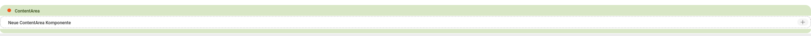
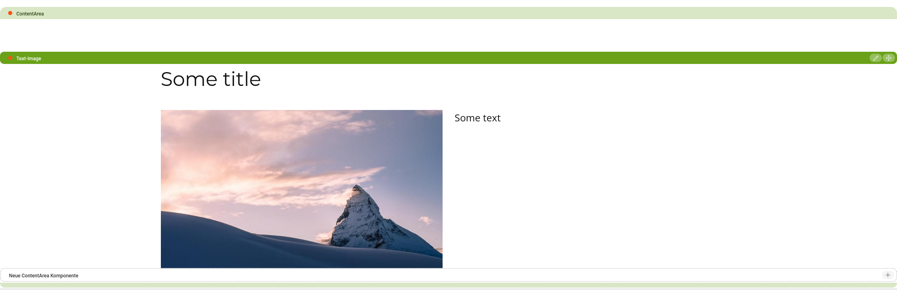

# Magnolia handlebars renderer

Handlebars implementation of magnolia renderer using [jknack](https://github.com/jknack/handlebars.java) library.

See [this README](blossom-reference-generator/README.md) for documentation on the blosom reference generator maven plugin.

## Setup
### DI-Bindings
- com.github.jknack.handlebars.io.ClassPathTemplateLoader
- com.merkle.oss.magnolia.renderer.handlebars.utils.DateUtil
- com.merkle.oss.magnolia.renderer.handlebars.utils.LinkUtil
- com.merkle.oss.magnolia.renderer.handlebars.utils.LocaleProvider
- com.merkle.oss.magnolia.renderer.handlebars.helpers.magnolia.TemplateScriptLocator

### Dependencies
#### Light-Development
##### POM
```xml
<dependency>
    <groupId>com.namics.oss.magnolia</groupId>
    <artifactId>magnolia-handlebars-renderer</artifactId>
    <version>${merkle.oss.handlebars-renderer.version}</version>
</dependency>
```
##### Magnolia-Module
```xml
<dependency>
    <name>magnolia-handlebars-renderer</name>
    <version>${merkle.oss.handlebars-renderer.version}</version>
</dependency>
```
#### Blossom
```xml
<dependency>
    <groupId>com.namics.oss.magnolia</groupId>
    <artifactId>magnolia-handlebars-renderer-blossom</artifactId>
    <version>${merkle.oss.handlebars-renderer.version}</version>
</dependency>
```
```xml
<dependency>
    <name>magnolia-handlebars-renderer-blossom</name>
    <version>${merkle.oss.handlebars-renderer.version}</version>
</dependency>
```

## Helpers
Helpers must extend [NamedHelper](src/main/java/com/merkle/oss/magnolia/renderer/handlebars/helpers/NamedHelper.java).
All except magnolia helpers (page, area, component) need to be bound manually. <br>
See package `com.merkle.oss.magnolia.renderer.handlebars.helpers` for available helpers.

### cms-page
The [PageElement](https://nexus.magnolia-cms.com/content/sites/magnolia.public.sites/ref/5.6.7/apidocs/info/magnolia/templating/elements/PageElement.html) 
Java class embeds the JavaScript and CSS needed to edit pages on the author instance. The output goes in the head element in the page HTML.
<br>
```handlebars
{{{cms-page}}}
```

### cms-area
The cms-area is used to render an area and any components inside it. Editors can add components inside the area. Available components are configured in the area definition.

The helper references an area by its name. The area name is the node that contains the area definition such as ContentArea, Footer or Stage.
The result on the page is an area bar and an end marker. The title property is rendered on the bar. When an editor clicks the add icon in the new component box they can add components inside the area.


```handlebars
{{{cms-area name='content-area' area="ContentArea" key=value}}}
```
Parameters:

| Key      |Type       |Description
|----------|-----------|-----------
| name     | String    |Name of the area element
| area     | String    |Name of the area definition node such as ContentArea, Footer or Stage.

Additional key-value params are added to the context. Can be used to pass key-value pairs to components inside this area.
#### supplier-page
The 'mgnl:supplierPage' node property can be set to reference another page which contains the desired area-node.

### cms-component
The cms-component helper renders a component. This tag is commonly used inside the area hbs file referenced by the cms-area helper.

The content to render, and possibly edit in case of an editable component, is passed in the data attribute. 
On the author instance the directive renders a component toolbar. The value of the title property in the component definition is rendered on the bar.

```handlebars
{{#each components}}
    {{{cms-component data=../componentData key=value}}}
{{/each}}
```
Parameters:

| Key      | Type    |Description
|----------|---------|-----------
| data     | Map     | content to render

Additional key-value params are added to the context. Can be used to pass key-value pairs to components inside this area.

## Custom ValueResolver
Custom jknack value resolvers can be configured by implementing a custom ValueResolversProvider
```xml
<component>
    <type>com.merkle.oss.magnolia.renderer.handlebars.renderer.HandlebarsRenderer$ValueResolversProvider</type>
    <implementation>custom.valueResolverProvider</implementation>
</component>
```

## Blossom component availability
### Role
For the blossom renderer components can be restricted for certain roles using the AvailableForRoles annotation:
```java
@AvailableForRoles("superuser")
@ContentArea
@Template(
		id = Script.ID,
		title = "templates.components." + Script.NAME + ".title",
		dialog = ScriptDialog.ID
)
@Controller
@TemplateDescription("templates.components." + Script.NAME + ".description")
public class Script extends BaseComponent {
    ...
}
```
### Custom
Example to only allow SomeComponent to be added inside backgroundArea:
```java
@ContentArea
@Template(
        id = Background.ID,
        title = "templates.components." + Background.NAME + ".title",
        dialog = BackgroundDialog.ID
)
@Controller
@TemplateDescription("templates.components." + Background.NAME + ".description")
public class Background extends BaseComponent {
    public static final String NAME = "Background";
    public static final String ID = COMPONENT_PREFIX + NAME;

    ...

    @Area(value = Background.BackgroundColorItemArea.NAME, title = "templates.areas." + Background.BackgroundColorItemArea.NAME + ".title")
    @AvailableComponentClasses({BackgroundArea.class})
    @Controller
    public static class BackgroundColorItemArea extends BaseArea {
        public static final String NAME = "BackgroundColorItemArea";
        ...
    }
}
```
```java
@BackgroundArea
public class BackgroundAreaComponentAvailabilityPredicate implements AreaAndComponentIdPredicate {
     @Override
     public boolean test(final AreaAndComponentId areaAndComponentId) {
         return SomeComponent.ID.equals(areaAndComponentId.getComponentId());
     }
}
```
```java
import com.google.inject.multibindings.MapBinder;
import com.merkle.oss.magnolia.renderer.handlebars.blossom.component.availability.ComponentAvailabilityPredicateResolver.AreaAndComponentIdPredicate;
import info.magnolia.objectfactory.guice.AbstractGuiceComponentConfigurer;

public class CustomGuiceComponentConfigurer extends AbstractGuiceComponentConfigurer {
	@Override
	protected void configure() {
		super.configure();
		MapBinder.newMapBinder(binder(), String.class, AreaAndComponentIdPredicate.class)
				.addBinding(Background.BackgroundColorItemArea.NAME).to(BackgroundAreaComponentAvailabilityPredicate.class);
	}
}
```